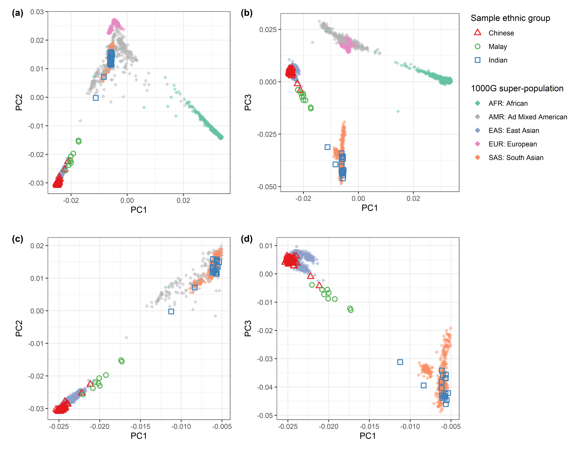
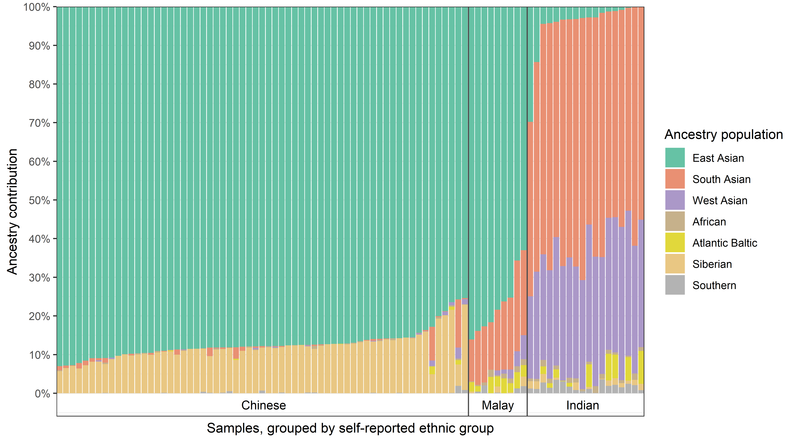
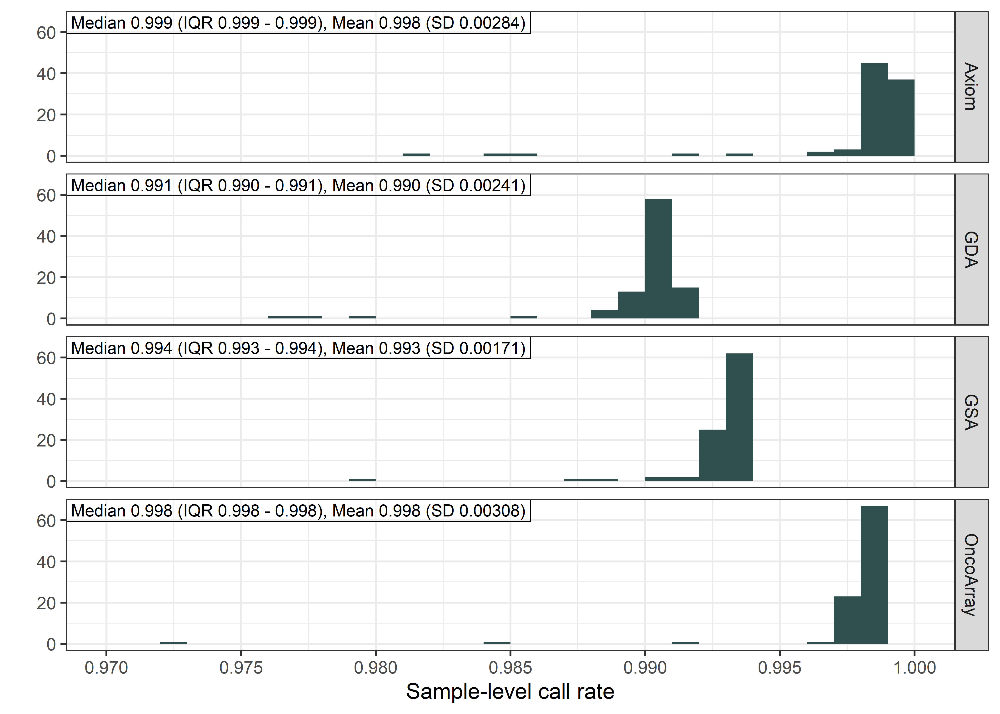
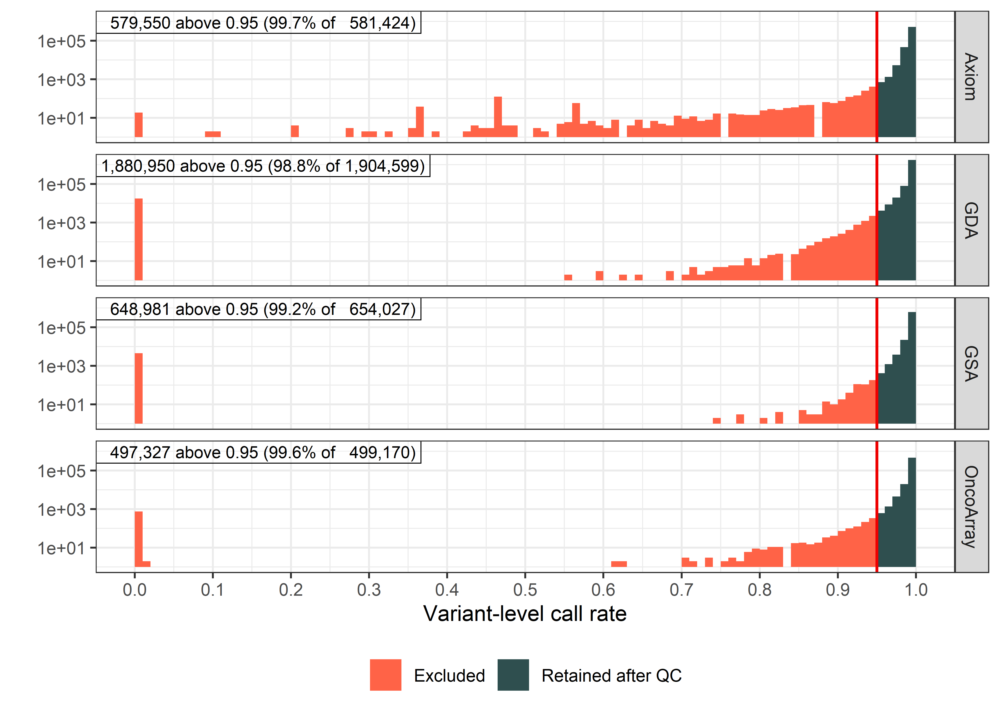
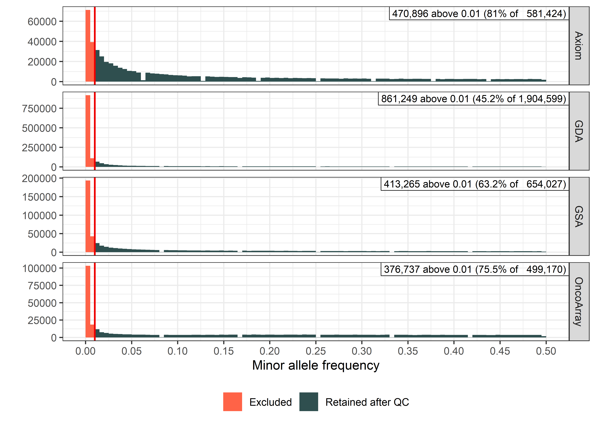

# Low-coverage whole-genome sequencing and genotyping data from four arrays for 90 Asian individuals

This repository contains code used for generating the figures in this manuscript:
> TODO: add citation information here

The data described in the manuscript is a subset of the data originally presented in:
> Ho, P. J., Khng, A. J., Tan, J. H. J., Goy, P.-A. V., Kamila, K. A., Li, Z., Ho, W. K., Tan, I. B. H., Chong, D. Q., Lo, E., Goh, L. L., Wee, H. L., Hartman, M., Dorajoo, R., Bertin, N. & Li, J. Genomic platform specific polygenic risk scores impact breast cancer risk stratification. *Commun. Med.* 6, 41 (2025). https://doi.org/10.1038/s43856-025-01298-4.

## Data access via the European Genome-phenome Archive (EGA)
The data described in the manuscript can be found on the European Genome-phenome Archive ([EGA](https://ega-archive.org)) with the accession numbers below.
- Study [EGAS00001008439](https://ega-archive.org/studies/EGAS00001008439): *Genomic platform specific polygenic risk scores impact breast cancer risk stratification*
  - Dataset [EGAD50000002806](https://ega-archive.org/datasets/EGAD50000002806): *Genotyping data from low-coverage whole genome sequencing (lc-WGS) for 90 Asian individuals*
  - Dataset [EGAD00010002834](https://ega-archive.org/datasets/EGAD00010002834): *Genotyping data from four arrays for 90 Asian individuals (Illumina GDA, Illumina GSA, Illumina OncoArray, and ThermoFisher Axiom)*

See EGA's step-by-step guide for requesting data access [here](https://ega-archive.org/access/request-data/how-to-request-data/). 
Data access is subject to approval by a data access committee ([EGAC00001003639](https://ega-archive.org/dacs/EGAC00001003639)), and requires the completion of a Data Access Agreement (DAA).

## Software versions  
Code in this repository was developed with the following software:
- R version 4.2.3 ("Shortstop Beagle")
- PLINK 1.9 (PLINK v1.9.0-b.7.11 64-bit, 19 Aug 2025)
- PLINK 2.0 (PLINK v2.0.0-a.6.29 64-bit, 28 Nov 2025)

The `renv` R package is used for dependency management. 
All packages and versions used are recorded in [`renv.lock`](renv.lock).
You can install required R packages by cloning this repository and running `renv::restore()`. 
See [package vignette](https://cran.r-project.org/web/packages/renv/vignettes/renv.html) for more information.

## Ancestry contributions of sample
### PCA with 1000G super-populations as reference
See [`01-PCA_1000G_superpopulation.sh`](code/01-PCA_1000G_superpopulation.sh).

> **Figure 1: PCA plots comparing genetic data of samples to super-populations in the 1000 Genomes Project**  
> Using PLINK 1.9, SNP data from the Illumina Infinium Global Diversity Array v1.0 (GDA, GRCh37) with call rate above 0.95, minor allele frequency above 0.01, and Hardy-Weinberg equilibrium p-value above 1e-7 was extracted for all samples. The same SNPs were extracted from the 1000G Phase 3 2016-05-05 primary release (build 37). SNPs in linkage disequilibrium (r2 > 0.2, window size 50, step size 5) and related samples (identity-by-descent proportion > 0.2) were removed. After removing 5,502 non-autosomal SNPs, PCA was conducted on 260,311 variants for 2,542 individuals (90 samples, 2,452 1000G).  
> **(a, b)** Principal components analysis (PCA) plots comparing the first PC (PC1) to PC2 and PC3 respectively. Self-reported ethnic groups for samples and super-population for data from the 1000 Genomes Project (1000G) are indicated by colour and shape.  
> **(c, d)** Magnified views of (a) and (b) respectively to show only the East Asian and South Asian 1000G super-populations. Samples mostly fall along this continuum.  
> 

### Admixture analysis with Dodecad K7b dataset
See [`02-admixture_analysis.R`](code/02-admixture_analysis.R).

> **Figure 2: Admixture analysis of ancestry contributions in samples**  
> The proportion of ancestry contributions from each population in the Dodecad K7b dataset is shown as a stacked bar plot, with each bar representing one sample. Samples are grouped by self-reported ethnic groups and ordered by ancestry contributions. The Dodecad K7b dataset was selected as it included reference ancestries which were more specific to Eurasia. Admixture analysis8 was conducted using the radmixture R package. Self-reported ethnic groups have appreciable differences in ancestry contributions, but all samples are mostly East/South/West Asian.  
> 

## Quality control metrics for genotyping array data
See [`03-genotyping_array_QC_metrics.sh`](code/03-genotyping_array_QC_metrics.sh).

> **Figure 3: Histogram of sample-level call rates for each genotyping array**  
> Sample-level call rate was calculated for variants directly genotyped by each array, using the `--missing` function in PLINK 1.9. The number of samples is shown on the y-axis. All samples had call rates above 0.97 across the arrays, indicating good sample quality.  
> 

> **Figure 4: Histogram of variant-level call rates for each genotyping array**  
> Variant-level call rate was calculated for variants directly genotyped by each array, using the `--missing` function in PLINK 1.9. The number of variants is shown on the y-axis in log-scale. In the original publication, variants with call rates below 0.95 (shown in red) were excluded as part of quality control measures. Across arrays, almost all variants had high call rates exceeding this threshold and genotyping data was largely retained after QC based on call rates.  
> 

> **Figure 5: Histogram of minor allele frequencies for each genotyping array**  
> Minor allele frequency was calculated for variants directly genotyped by each array, using the `--freq` function in PLINK 1.9. The number of variants is shown on the y-axis. In the original publication, variants with minor allele frequency below 0.01 (shown in red) were excluded as part of quality control measures. Most variants had minor allele frequencies exceeding this threshold and were retained. 
> 
